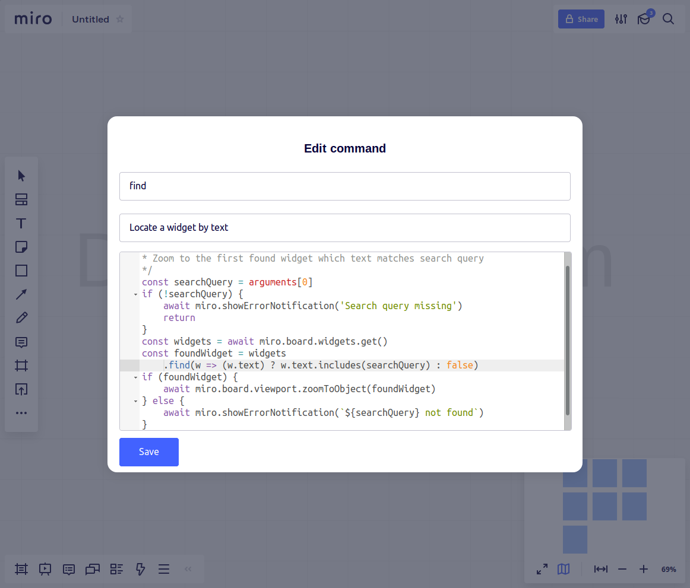
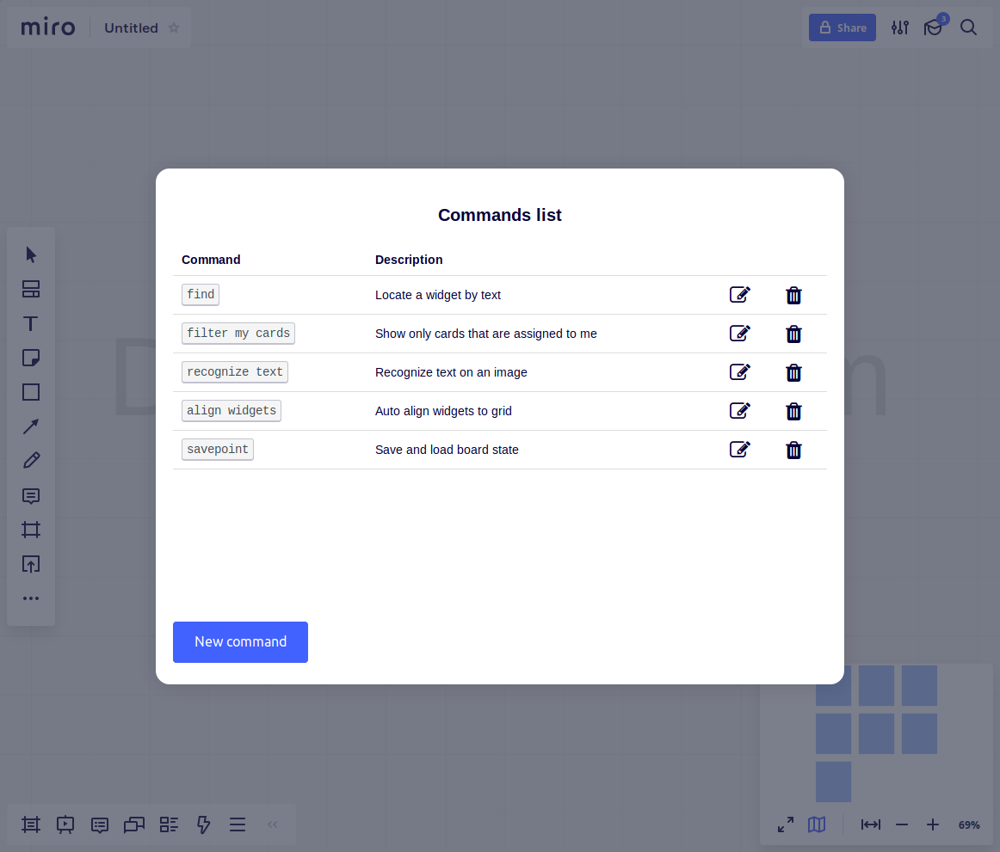

## Command palette 
A plugin for [miro](https://miro.com) collaborative board that empowers users to automate routine tasks by creating their own custom scripts

    
    

[Demo video](https://raw.githubusercontent.com/qweeze/miro-command-palette/master/docs/demo.webm)

### Usage

- Fire up plugin